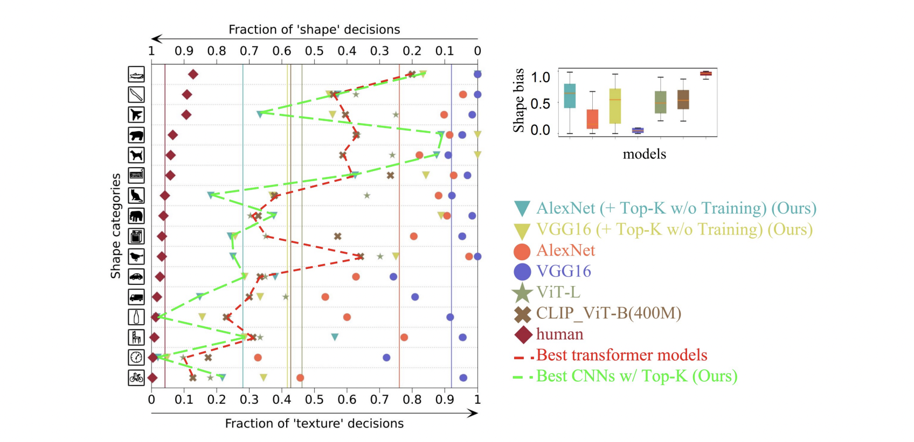
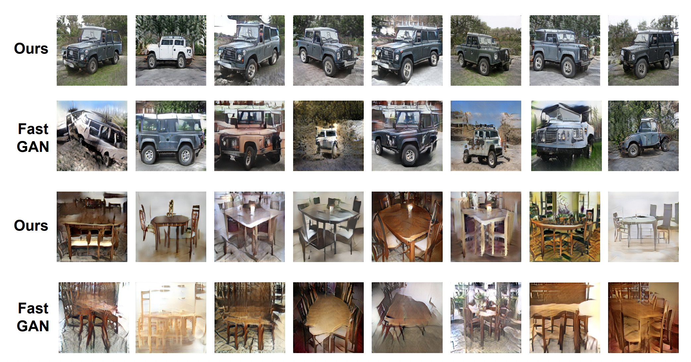

## Emergence of Shape Bias in Convolutional Neural Networks through Activation Sparsity
<br>

This repo serves as supporting material of paper *Emergence of Shape Bias in Convolutional Neural Networks through Activation Sparsity*. The repo has been anonymized to abid the double-blind review process. 

This README is structured in 
* Visualization
* CNN inference with Top-K to improve shape bias
* CNN training with Top-K
* Few shot image synthesis with Top-K


<h4 align="center">Top-K sparsified simple CNNs reach the shape bias of Transformers (ViT).</h4>


## 1. Visualization

Two visualizations are provided. 

1. Texture synthesis difference with / without Top-K neurons. 
The code that supports section 4.1 is documented inside `texture-synthesis-visualization`. To reproduce the results, first download the [pretrained VGG model](texture-synthesis-visualization/models/VGG19_normalized_avg_pool_pytorch) and place it manually inside `texture-synthesis-visualization/models/VGG19_normalized_avg_pool_pytorch` (A normal github pull would only provide a place holder, to download the model, either download manually or use git lfs. Ensure the MD5 of the downloaded model to `5ef7cf6e11ebbdc1fe2e4f7c44d3f2b8`). After place the model in the correct folder, go to `texture-synthesis-visualization` and follow the instructions below to reproduce the results. Examples are shown below.


<h4 align="center">Top-K Neurons Encode Structural Information. Visualization with Texture Synthesis program (TS).</h4>

* Texture synthesis with Top-K + non Top-K neurons

```
python3 synthesize.py -i ../few-shot-img-syn/data/jeep -o output_jeep_all --topk 1.
```

* Texture synthesis with non Top-K neurons only

```
python3 synthesize.py -i ../few-shot-img-syn/data/jeep -o output_jeep_non_topk --topk 0.05 --reverse_topk
```


2. Direct visualization of the Top-K neurons and non Top-K neuron via reconstruction. 


<h4 align="center">Visualizing Top-K and non Top-K neurons through optimizing input images to match their activation.</h4>

In supplementary section 1, we directly visualize the pretrained VGG models' Top-K firing neuron and non Top-K firing neurons. Following the same procedure above to put the pretrained model into `topk-neurons-visualization-supp/models` folder and go to `topk-neurons-visualization-supp`. The results of the supplementary section 1 could be reproduced via:

* Texture synthesis with Top-K + non Top-K neurons

```
python3 synthesize.py -i ../few-shot-img-syn/data/jeep -o vis_jeep_all --topk 1. --lr 10 -n 1
```

* Texture synthesis with Top-K neurons only

```
python3 synthesize.py -i ../few-shot-img-syn/data/jeep -o vis_jeep_topk --topk 0.05 --lr 10 -n 1
```
* Texture synthesis with non Top-K neurons only

```
python3 synthesize.py -i ../few-shot-img-syn/data/jeep -o vis_jeep_non_topk --topk 0.05 --reverse_topk --lr 10 -n 1
```


## 2. CNN inference with Top-K to improve shape bias


<h4 align="center">Top-K sparsified simple CNNs reach the shape bias of Transformers (ViT).</h4>


<h4 align="center">Ablation Top-K: Different category favors different sparsity.</h4>


To reproduce the above results, go to `cnns-inference-top-k/model-vs-human_topK`. We modify the [shape bias benchmark](https://github.com/bethgelab/model-vs-human) to evaluate models with Top-K layers installed. Our Top-K layers are implemented in `cnns-inference-top-k/model-vs-human_topK/modelvshuman/models/pytorch/topK/topK.py`, currently only pytorch version is supported. 

The results in section 4.2 can be reproduced using the bash file provided under `cnns-inference-top-k/model-vs-human_topK` after configuring the proper environment (We recommend to follow the installing instruction of the [shape bias benchmark](https://github.com/bethgelab/model-vs-human)).


## 3. CNN training with Top-K

We provide the code to reproduce the results in section 4.3 in the main manuscript. To train with Top-K, go to `cnns-train-top-k/scripts/IN-S1` or `cnns-train-top-k/scripts/IN-S2` and then: 

```bash
bash run_topk.sh [train_data_datafolder] [stylized_evaluation_datafolder]
```

We utilize the mechanism from github repo [pytorch-AdaIN](https://github.com/naoto0804/pytorch-AdaIN) to create costomized stylized ImageNet subset. For each subset of ImageNet, we transfer the evaluation data into stylized version. The target styles are listed inside `cnns-train-top-k/style_target`. We use `--alpha 0.5` to balance the original content and the transferred texture otherwise the transferred content wouldn't be recognizable even by human eyes. 

## 4. Few shot image synthesis with Top-K

The code to reproduce section 4.3 can be found inside `few-shot-img-syn` including the datasets (100 images for each category) trained on. The program will evaluate the synthesis quality every 1000 training steps and keep the best performing model sofar. The model will typically converge after 30,000 - 50,0000 steps of training but the actual convergence depends on the datasets. The best Top-K sparsity hyperparameters are provided inside `few-shot-img-syn/TopKGen/scripts/[category]/run.sh`. 


<h4 align="center">Few Shot Synthesis Examples with Top-K.</h4>

The synthesis program is wrapped as a package. To run the model, first go to `few-shot-img-syn` and run 

```bash
pip3 install -e .
```

then, go to `few-shot-img-syn/TopKGen/scripts/[category]` and use `run.sh` to start the training program. The evaluation will be done every 1000 steps automatically (sampling 3000 images and evaluate FID & KID).

